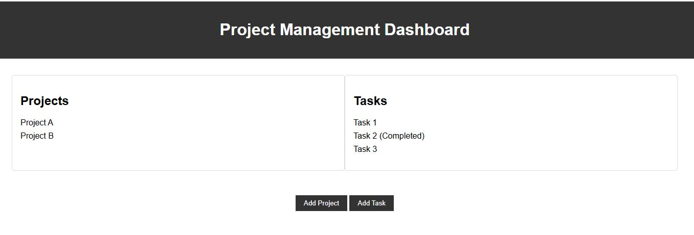

# 📊 Project Management Dashboard

A **web-based Project Management Dashboard** designed to help teams and individuals organize, track, and manage projects efficiently.  
It provides a **centralized view of tasks, deadlines, and project progress** with an easy-to-use interface.

---

## 🚀 Features
- ✅ **Task Management** – Add, edit, and delete tasks easily  
- ✅ **Deadline Tracking** – View upcoming deadlines and overdue tasks  
- ✅ **Progress Visualization** – Charts/graphs for project status  
- ✅ **Team Collaboration** – Assign tasks to team members  
- ✅ **Responsive Design** – Works smoothly on desktop & mobile  

---

## 🛠️ Tech Stack
- **HTML5** – Structure  
- **CSS3** – Styling & responsive design  
- **JavaScript** – Dynamic functionality  
- *(Optional: Backend – Node.js / Django / Firebase)*  

---

## 📂 Project Structure
project-management-dashboard/
│── index.html # Main dashboard UI
│── style.css # Styling
│── script.js # Core logic

## 📊 Dashboard Preview

